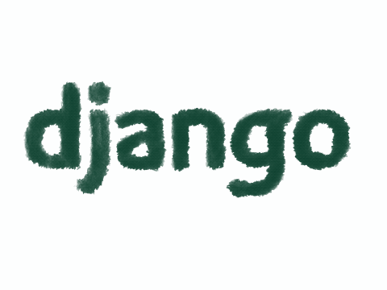

 
  
<h1 align="center">Index of Django Projects</h1>

<table>
    <thead>
        <tr>
            <td>Project Name</td>
            <td>Repo Link</td>
            <td>App Link</td>
            <td>Overview</td>
        </tr>
    </thead>
    <tbody> 
        <tr>
            <td>ToDo App</td>
            <td><a href="https://github.com/nurkocar/TODO-APP-DJANGO" target="_blank">Repo details</a></td>
            <td><a href="https://github.com/nurkocar/TODO-APP-DJANGO">Click here to see the project</a></td>
            <td></td> 
        </tr>
        <tr>
            <td>Blog</td>
            <td><a href="https://github.com/nurkocar/Blog-Project-DJANGO" target="_blank">Repo details</a></td>
            <td><a href="https://github.com/nurkocar/Blog-Project-DJANGO" target="_blank">Click here to see the project</a></td>
            <td></td> 
        </tr>
        <tr>
            <td>Rest Framework</td>
            <td><a href="https://github.com/nurkocar/Django-Rest-Framework" target="_blank">Repo details</a></td>
            <td><a href="https://github.com/nurkocar/Django-Rest-Framework" target="_blank">Click here to see the project</a></td>
            <td></td> 
        </tr>
        <tr>
            <td>Quiz Project</td>
            <td><a href="https://github.com/nurkocar/QuizProject-DJANGO" target="_blank">Repo details</a></td>
            <td><a href="https://github.com/nurkocar/QuizProject-DJANGO" target="_blank">Click here to see the project</a></td>
            <td></td> 
        </tr>
        <tr>
            <td>Recipe Blog Backend</td>
            <td><a href="https://github.com/nurkocar/BlogProject-Backend-Django" target="_blank">Repo details</a></td>
            <td><a href="https://github.com/nurkocar/BlogProject-Backend-Django" target="_blank">Click here to see the project</a></td>
            <td></td> 
        </tr>
        
</tbody>
</table>
